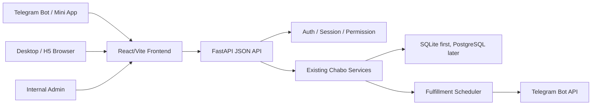
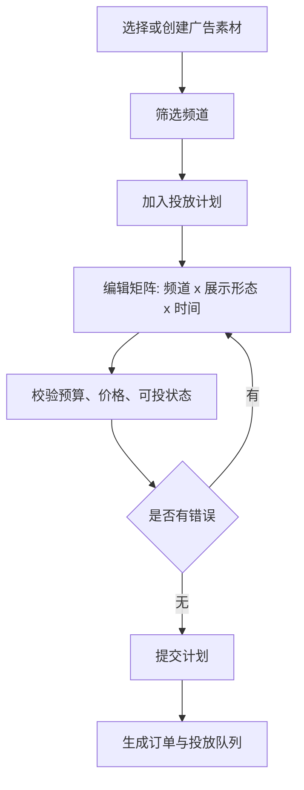

# 插播网页端后台管理开发文档

版本：v0.2
日期：2026-05-02
状态：网页端框架定版与后续开发参照

## 1. 文档定位

本文用于指导“插播”项目的网页端、H5 端和后台管理端开发。它不替代 `DOC/插播_项目施工图.md`，而是在现有 Bot 与服务层基础上，补充面向内部运营、广告主、频道主的大屏和移动网页工作台。

本文的核心结论：

- 网页端应做成一个统一的 Web 应用，通过路由、权限和界面入口区分“管理端、广告主端、频道主端”，不要真的拆成三套独立系统。
- 前端框架直接定版为 `React + TypeScript + Vite`，按复杂后台工作台和批量投放矩阵来设计，不再把 React 放到二期或局部组件岛。
- 通用中后台 UI 推荐 `Ant Design`；高密度频道选择、投放矩阵、批量编辑、服务端分页/筛选/分组等核心表格能力推荐 `AG Grid Enterprise`。如果后续明确不购买商业授权，再降级为 `TanStack Table + TanStack Virtual` 自研矩阵。
- 后端定版为 `FastAPI JSON API + 现有 Chabo service/database 层`。当前 `src/chabo/web.py` 只保留 `/health`、webhook 和过渡期轻量后台，不再作为正式网页端扩展基座。

## 2. 项目最终目标

插播最终要从“Telegram Bot 点选下单”升级为“Telegram 入口 + 网页工作台 + 后台运营系统”的可信广告履约平台。

目标不是只做一个漂亮页面，而是解决三个角色的大批量操作问题：

- 内部管理端：运营人员审核素材、审核订单、处理充值、处理争议、查看账务、排查履约、代用户测试和干预风险订单。
- 广告主端：广告主管理素材库、筛选频道、批量选择频道和广告位、生成投放计划、控制预算、查看订单和效果复盘。
- 频道主端：频道主管理多个频道、设置接单规则、设置价格和频率、查看收入、处理异常、维护频道资料。

Bot 仍然重要，但它应定位为通知、轻量操作、深链接入口和小单交易入口；网页端负责复杂管理、批量选择、横向对比、报表和运营后台。

## 3. 对当前方案的反思

此前“用 Bot 按钮逐步选择频道、广告、位置、频率”的方案可以跑通最小闭环，但它有明显边界：

- 批量性不足：广告主同时选择几十个频道、多个展示形态、多个时间段时，按钮流程会变成重复劳动。
- 可视化不足：频道价格、风险、历史效果、余额占用、投放状态需要横向比较，Bot 消息无法承载密集表格。
- 审核与运营不足：运营人员需要筛选、排序、批量通过、批量退款、异常追踪和审计日志，简单 `/admin` 页面只能临时救急。
- 权限模型不足：管理端、广告主端、频道主端不能只靠 Telegram callback 判断，需要独立的 Web 登录、会话、角色、权限和审计。
- H5 与桌面能力不同：手机适合审批、查看、少量调整；桌面才适合大规模矩阵选择和表格编辑。不能承诺手机端完全等价替代桌面端。
- 数据库压力会增加：当前 SQLite 对 MVP 足够，但网页端会带来更多并发查询、筛选、批量写入和报表，必须预留 PostgreSQL 迁移路径。
- 如果把“三个端口”理解成三套代码，会产生重复 UI、重复权限、重复查询和重复部署。正确做法是同一应用、不同门户、同一权限中心。

因此，网页端建设的第一原则是：把复杂操作从 Bot 迁移到 Web，但核心业务动作仍然通过现有 service 层完成，不能绕开账本、审核、履约和证据链。

## 4. 前端/网页架构选项对比

### 4.1 最终选型结论

最终框架定为：

```text
Frontend:
  React + TypeScript + Vite
  React Router
  TanStack Query
  Ant Design
  AG Grid Enterprise

Backend:
  FastAPI JSON API
  Existing Chabo services
  SQLite first, PostgreSQL migration path
```

这个选择不是为了省事，而是为了交互上限：

- 广告主会面对大量频道、多条件筛选、多选、分组、收藏、频道集合、不同频道可投位置不同、不同展示形态不同价格等复杂状态。
- 投放计划不是普通表单，而是“频道 x 展示形态 x 时间 x 预算 x 校验状态”的矩阵编辑器。
- 管理端需要大量表格、筛选、批量动作、状态追踪和审计。
- H5 需要和桌面共用业务逻辑、权限和接口，但展示方式要降维成卡片、集合和模板。
- 你已有 React 项目经验，团队迁移成本低；React 生态在复杂数据表格、状态管理和后台组件上优势明显。

### 4.2 备选方案表

| 方案 | 适合点 | 优点 | 风险/缺点 | 对插播的判断 |
| --- | --- | --- | --- | --- |
| React + TypeScript + Vite + FastAPI API | 复杂后台工作台、批量投放矩阵、H5 共用逻辑 | 交互上限高；开发体验快；生产可静态部署；与现有 Python 后端边界清楚；你已有 React 经验 | 需要设计 API 契约、鉴权、前端状态和构建流程 | 最终选型 |
| Next.js + Python API | 需要 SSR、SEO、公开内容页、React 全栈路由 | React 生态完整；SSR 和文件路由成熟；适合公开产品站 | 需要 Node 服务；和 Python API 形成双后端；本项目登录后后台为主，SSR 优势有限 | 不作为首选；未来官网/公开市场页可单独评估 |
| FastAPI + Jinja2 + HTMX | 表单后台、轻量管理、渐进交互 | 简单；部署轻；权限集中在服务端 | 对投放矩阵、复杂选择、局部状态、表格虚拟滚动不够强 | 作为极简过渡方案，不作为正式框架 |
| Vue/Nuxt + Python API | 中后台、国内团队 Vue 经验强 | 上手直观；组件生态成熟 | 你现有项目是 React；复杂表格生态和招聘面不明显优于 React | 除非团队整体转 Vue，否则不选 |
| SvelteKit + Python API | 小团队、轻量高交互 | 代码量少；体验好 | 生态、招聘和长期维护风险高于 React | 不选 |
| Django + Django Admin | 内部管理、数据模型后台 | 内置 admin/auth/ORM；后台生成快 | 当前项目不是 Django/ORM；迁移成本高；广告主/频道主门户仍需定制 | 不建议为了 admin 重构整项目 |
| 继续扩展 stdlib `web.py` | 临时维护、少量 JSON/HTML | 零依赖；当前已存在 | 路由、模板、会话、安全、静态资源、测试都会越来越难 | 不适合正式网页端，只保留兼容和过渡 |

### 4.3 为什么不是 Next.js

Next.js 也是 React，但它的核心优势在 SSR、公开页面、SEO、服务端组件和 Node 侧路由。本项目主要是登录后的后台工作台，最关键的是复杂表格、批量选择、矩阵编辑、低延迟状态反馈和清晰的 Python 业务 API。

如果使用 Next.js，会多出一个 Node 服务层，需要决定：

- session 和权限在 Next.js 还是 FastAPI 校验；
- API 是 Next.js 转发还是浏览器直连 FastAPI；
- 运营动作审计和 CSRF 由哪一层负责；
- 部署时同时维护 Node 与 Python 两套运行时。

这些复杂度对当前核心交互没有明显加分。因此，正式后台选择 Vite SPA + FastAPI API 更直接。未来如果要做公开频道市场、SEO 页面、官网、内容页，可以单独引入 Next.js，不影响后台工作台。

### 4.4 为什么表格选 AG Grid Enterprise

投放矩阵是本项目最难的前端模块。普通 Table 只能解决“展示列表”，但这里需要的是接近表格软件的交互：

- 大量频道行，虚拟滚动。
- 服务端分页、筛选、排序、分组。
- 跨页选择和保留选择。
- 每行根据频道规则显示不同可选投放位。
- 批量编辑价格、频率、时间、置顶、预算。
- 单元格校验、错误标记、部分成功/失败反馈。
- 管理端未来可能需要导出、分组、聚合、审计筛选。

AG Grid Enterprise 在这些能力上比普通组件库 Table 更接近成品工作台。Ant Design 继续负责布局、表单、弹窗、抽屉、菜单和移动端组件；AG Grid 只负责高密度表格和矩阵区域。

如果商业授权暂时不确定，备选是 `TanStack Table + TanStack Virtual`。它更自由，但需要自研选择、编辑、键盘导航、复制粘贴、分组和校验表现；适合后期我们确定 AG Grid 授权不合适时再切。

### 4.5 前端状态边界

```text
Server state:
  TanStack Query
  - 频道列表、订单列表、钱包、报表、权限、计划详情
  - 分页、筛选、缓存、刷新、提交后失效重拉

Client/UI state:
  React local state / reducer
  - 当前选中的频道、展开行、批量编辑草稿、筛选面板开关

Complex planner state:
  useReducer or lightweight store
  - 投放矩阵草稿、跨页选择、批量编辑队列、校验结果映射
```

原则：服务端状态不要放进全局 store，矩阵草稿不要散落在几十个组件里。

## 5. 总体架构



### 5.1 应用边界

新增正式前端目录：

```text
web/
  package.json
  vite.config.ts
  tsconfig.json
  src/
    main.tsx
    app/
      router.tsx
      providers.tsx
      layout/
    routes/
      admin/
      advertiser/
      publisher/
      auth/
    features/
      planner/
      channels/
      creatives/
      orders/
      wallet/
      earnings/
      audit/
    shared/
      api/
      auth/
      components/
      hooks/
      styles/
      telegram/
      utils/
```

新增正式 API 模块：

```text
src/chabo/webapi/
  main.py              # FastAPI app factory
  deps.py              # Settings, DB, current_user, service dependencies
  auth.py              # Telegram 登录、magic link、admin 登录、session
  permissions.py       # role/capability checks
  routes/
    admin.py
    advertiser.py
    publisher.py
    auth.py
  schemas/
    admin.py
    advertiser.py
    publisher.py
    common.py
  errors.py
```

保留但不继续膨胀：

- `src/chabo/web.py`：继续承载 `/health`、Telegram webhook 和过渡期轻量 `/admin`。
- 后续稳定后，可以让 `web.py` 只负责兼容入口，或把 webhook 合并到 FastAPI API。

核心约束：

- 前端不能自行计算最终价格、权限和可投状态，只能展示 API 返回的校验结果。
- API 路由不能直接散写复杂业务规则。列表查询可走 read model，但创建订单、审核、退款、调度、收益确认必须调用 service 层。
- Bot 与 Web API 不能互相调用 UI 方法。它们都应该调用同一组业务服务。
- 高影响动作必须写审计日志：审核通过/拒绝、退款、收益确认、权限授予、代用户操作、价格修改、频道禁用。

## 6. 三端门户设计

这里的“三个端口”建议理解为三个门户，而不是三套系统。

推荐路由：

```text
/admin
/advertiser
/publisher
```

可选域名：

```text
admin.example.com -> /admin
app.example.com/advertiser
app.example.com/publisher
```

### 6.1 管理端

管理端只对内部人员开放。管理员可以：

- 查看全部广告主、频道主、频道、素材、订单、投放、账务和争议。
- 审核素材、审核订单、拒绝订单、执行退款、处理充值、确认收益。
- 以广告主或频道主身份预览门户，但所有代操作必须记录 impersonation 审计。
- 手工授予或撤销广告主端、频道主端权限。
- 查看系统健康、调度状态、失败投放、Telegram 权限异常。

管理端不应公开在普通用户入口里。即使前端隐藏了入口，后端也必须用权限强校验。

### 6.2 广告主端

广告主端面向有投放意图或已经投放过的用户。核心页面：

- 概览：余额、冻结预算、进行中订单、待审核订单、最近投放结果。
- 素材库：创建、编辑、归档广告素材，管理短入口、标准文案、媒体、目标链接、按钮文字。
- 频道市场：筛选频道、查看价格、风险、分类、历史表现、收藏频道、频道集合。
- 投放计划：批量选择频道和展示形态，生成预算矩阵，校验余额和可投状态。
- 订单：查看订单、投放进度、失败原因、退款状态、证据快照。
- 钱包/充值：充值申请、余额流水、预算冻结和释放。
- 报表：按素材、频道、展示形态、日期查看成本、点击/start、履约状态。

### 6.3 频道主端

频道主端面向真正有广告产出的频道主。核心页面：

- 概览：频道数量、待处理异常、待确认收益、最近收入。
- 频道列表：多个频道的启用状态、Bot 权限、订阅状态、价格状态。
- 频道详情：展示形态开关、价格、每日广告上限、可投时段、风险类目限制。
- 收益：待确认收益、已确认收益、退款冲销、结算记录。
- 广告记录：本频道已发布、待发布、失败、争议中的广告。
- 设置：收入通知、频道管理员同步、频道资料和招商文案。

### 6.4 门户切换

同一个 Telegram 用户可能同时是广告主和频道主。登录后：

- 若只有一个权限，只进入对应门户。
- 若有多个权限，显示门户切换。
- 管理员登录后默认进入管理端，但可以选择“以用户身份查看广告主端/频道主端”。
- 被管理员代看的用户界面必须有明显内部提示，且所有写操作进入审计日志。

## 7. 登录、权限和开通规则

### 7.1 登录方式

广告主/频道主：

- Telegram Mini App：校验 Telegram Web App `initData`，适合从 Bot 内打开。
- Magic link：用户在 Bot 里点击“打开网页端”，Bot 生成一次性登录链接，适合外部浏览器和桌面端。
- 会话 cookie：登录后使用 HttpOnly、Secure、SameSite cookie 保存 session。
- 普通 `/login` 不暴露管理 Token 表单；管理端使用隐藏 `/login/admin` 或后台手工生成一次性链接。

管理端：

- MVP 可用管理员账号 + 强密码 + TOTP，或部署在 VPN/IP allowlist 后。
- 不建议继续使用 URL query token 作为正式管理端认证。
- 后续可接入公司 SSO。

### 7.2 权限模型

建议新增权限表，而不是只复用 `accounts.role`：

```text
web_users / operator_users
web_sessions
portal_access
portal_access_events
impersonation_sessions
login_tokens
```

`portal_access` 最小字段：

```text
id
account_id
portal              # advertiser / publisher / admin
status              # candidate / active / suspended / revoked
grant_reason        # manual / first_successful_order / first_paid_delivery / imported
granted_by_account_id
granted_at
revoked_at
metadata_json
```

### 7.3 自动开通标准

广告主端：

- 候选广告主：创建素材、发起报价、打开广告主入口即可成为候选。
- 正式广告主：至少有一次真实投放进入 `sent` 或 `confirmed`，或由管理员手动开通。
- 当前 M7 第一批实现为：首次投放审核通过即可从候选广告主自动升为 active；后续可再收紧到 `sent / confirmed`。
- 未正式开通前，可以展示引导页、素材创建、单次下单入口，但不开放完整批量计划和报表。

频道主端：

- 候选频道主：把 Bot 拉入频道、完成频道识别、同步管理员即可成为候选。
- 正式频道主：其拥有的频道至少有一次真实付费投放进入 `sent` 或 `confirmed`，或由管理员手动开通。
- 仅拉入 Bot 不等于正式频道主，只能看到接入进度和基础设置。

管理员：

- 由内部运营手动创建，不通过 Telegram 自动开通。
- 管理员权限已按 `portal_access.metadata_json.admin_level` 分级：`viewer` 只读，`operator` 可处理订单/争议/删帖异常，`finance` 可处理入账和退款，`super_admin` 拥有全部能力并可代看用户门户。
- `super_admin` 可通过管理端账户列表手工调整门户：广告主端/频道主端支持开通、设候选、撤销；管理员端支持设置等级或撤销管理员。
- `portal_access.status = revoked` 表示人工撤销，自动开通规则必须尊重撤销状态，不得因历史投放重新激活。
- 管理员代看通过 `impersonation_sessions` 和 `web_sessions.impersonator_account_id` 记录；代看 session 使用独立 TTL；进入广告主/频道主端后页面顶部必须显示内部代看状态和到期时间，主动结束时返回管理端并写审计。
- 管理端审计页必须支持按“权限调整 / 代看 / 管理员等级”过滤，权限等级类只记录真正调整 `admin_level` 的事件，不混入普通广告主端/频道主端开关。
- 审计页生产可用能力包括按操作者、目标账号和时间范围筛选、单条审计详情抽屉、CSV 导出。手工开通、撤销、设候选和管理员等级调整必须填写备注并二次确认。
- 不可抵赖要求：新写入审计记录必须包含 `previous_hash / audit_hash / hash_version` 链式摘要；权限变更审计必须包含 before / after / changed_fields；管理员代看必须填写原因；审计 CSV 导出仅限 `super_admin`，导出结果必须带 CSV SHA-256、导出前链头，并把导出动作自身写回审计；生产 `preflight` 会校验审计保留天数和导出上限配置。
- 生产环境必须关闭 `CHABO_DEV_AUTH_BYPASS` 和 `CHABO_DEV_SESSION_ENABLED`；`preflight` 与运行时都会阻止生产 dev bypass。

## 8. 批量投放工作流

批量投放是网页端的核心，不应照搬 Bot 的逐步按钮。

### 8.1 广告主桌面流程



桌面端应重点支持：

- 多条件筛选：分类、价格区间、风险等级、订阅状态、可投展示形态、频道质量分。
- 多选加入计划：收藏夹、频道集合、最近投放、搜索结果。
- 表格批量编辑：展示形态、发布次数、频率、开始时间、置顶、预算上限。
- 实时预算摘要：总预算、冻结金额、余额不足、单频道成本、平台费。
- 校验结果：不可投、价格缺失、频道禁用、Bot 权限异常、素材不适配、余额不足。
- 保存草稿：大计划不能要求一次编辑完成。

### 8.2 H5 流程

手机端不强求完整矩阵编辑，重点支持：

- 选择素材。
- 选择频道集合或最近使用频道。
- 使用模板：单次投放、7 天循环、30 天循环。
- 查看预算摘要。
- 提交或保存草稿。
- 查看订单状态和失败原因。

原则：H5 要能完成下单和管理，但复杂的几十频道矩阵编辑应提示“桌面端体验更完整”。

### 8.3 建议新增数据模型

```text
placement_plans
  id
  advertiser_account_id
  creative_id
  status              # draft / validating / ready / submitted / cancelled
  title
  currency
  total_budget_cents
  validation_summary_json
  created_at
  submitted_at

placement_plan_items
  id
  plan_id
  channel_id
  slot_type
  placement_format
  schedule_mode       # once / recurring
  starts_at
  ends_at
  frequency_per_day
  pin_enabled
  unit_price_cents
  estimated_total_cents
  status              # draft / valid / invalid / converted
  validation_errors_json

placement_plan_orders
  plan_id
  plan_item_id
  order_id
```

提交计划时必须事务化：

- 再次校验频道、价格、素材、余额。
- 对每个有效 item 创建订单。
- 统一冻结预算。
- 写入计划与订单映射。
- 任一关键失败必须回滚，或明确进入部分成功状态并展示失败项。

## 9. 页面清单

### 9.1 管理端 MVP

- `/admin`：运营总览。
- `/admin/orders`：订单列表，支持状态、频道、广告主、时间筛选。
- `/admin/orders/{id}`：订单详情、素材快照、价格快照、投放记录、审核动作。
- `/admin/deliveries`：投放队列和失败投放。
- `/admin/disputes`：争议列表与处理。
- `/admin/topups`：充值申请审核。
- `/admin/wallet`：全站资金总览、待审入账状态、最近账本流水和资金账户榜。
- `/admin/accounts`：账户检索、余额、权限状态。
- `/admin/channels`：频道检索、Bot 权限、价格策略、广告位状态。
- `/admin/audit-logs`：高影响操作审计，支持分页、全文搜索、“权限调整 / 代看 / 管理员等级”分类筛选、操作者 / 目标账号 / 时间范围筛选、链头展示、审计链时间窗 / 严格模式校验、详情抽屉、权限前后 diff 和 CSV 导出。
- `/admin/settings`：生产安全开关、审计策略、数据库备份、发布准入状态。

### 9.2 广告主端 MVP

- `/advertiser`：概览。
- `/advertiser/creatives`：素材库。
- `/advertiser/channels`：频道市场。
- `/advertiser/collections`：频道集合/收藏。
- `/advertiser/plans`：投放计划列表。
- `/advertiser/plans/new`：新建投放计划。
- `/advertiser/plans/{id}`：投放矩阵编辑和预算校验。
- `/advertiser/orders`：订单列表。
- `/advertiser/wallet`：余额、冻结订单和账本流水。
- `/advertiser/reports`：基础报表。

### 9.3 频道主端 MVP

- `/publisher`：概览。
- `/publisher/channels`：频道列表。
- `/publisher/channels/{id}`：频道配置。
- `/publisher/orders`：频道收到的广告记录。
- `/publisher/earnings`：总收益、频道维度收益和冲销。
- `/publisher/settings`：通知和资料设置。

## 10. UI/交互原则

这不是营销站，而是内部和业务用户反复操作的后台工具。

桌面端：

- 使用左侧导航 + 顶部账户/门户切换。
- 页面主体以表格、筛选栏、详情抽屉、批量操作栏为主。
- 表格必须支持服务端分页、筛选、排序，避免一次性加载大量数据。
- 批量动作前显示影响范围和金额摘要。
- 高风险动作使用确认对话框，并要求填写原因。

H5：

- 使用底部或顶部轻导航，减少多级菜单。
- 表格在手机上改成任务卡片或分组列表。
- 关键摘要固定显示：余额、预算、待处理数量、提交按钮。
- 批量计划在 H5 上使用“集合 + 模板 + 摘要确认”，不要硬塞桌面表格。

通用：

- Ant Design 负责：导航、布局、表单、按钮、弹窗、抽屉、步骤条、筛选面板、移动端基础组件。
- AG Grid 负责：频道市场表格、投放矩阵、管理端高密度列表、需要虚拟滚动/跨页选择/批量编辑的区域。
- 不要用 Ant Design Table 实现投放矩阵；它可以用于小型列表，但不是复杂表格工作台核心。
- 所有金额显示统一为 USD 或未来配置币种，不在前端自行换算。
- 错误提示必须说清楚用户下一步能做什么。
- 用户看不到无权限入口；但后端仍然必须拦截。
- 管理员代用户查看时，页面必须显示内部状态提示。

## 11. 后端接口与服务层改造

### 11.1 必须沉淀的服务动作

广告主：

- 创建/更新/归档素材。
- 查询频道市场。
- 创建/保存/校验/提交投放计划。
- 查询订单、投放、报表。
- 创建充值申请。

频道主：

- 查询拥有/管理的频道。
- 更新频道广告策略。
- 更新价格和每日限制。
- 查询收益和广告记录。

管理端：

- 审核订单。
- 拒绝订单。
- 退款/部分退款。
- 处理充值。
- 处理争议。
- 手动授予/撤销门户权限。
- 发起一次调度或收益确认。

### 11.2 查询层

现有 service 层适合业务写动作，但后台还需要复杂列表查询。建议新增只读查询模块：

```text
src/chabo/readmodels/
  admin.py
  advertiser.py
  publisher.py
```

读模型可以写清晰 SQL，但必须：

- 不修改数据。
- 不绕开权限过滤。
- 对分页和排序做白名单。
- 对大列表加索引。

## 12. 数据库与迁移策略

MVP 可以继续 SQLite，因为当前项目已经围绕 SQLite 建立迁移和测试。但需要设置迁移触发条件：

- 同时在线运营人员和用户明显增加。
- 报表查询影响下单和调度。
- 批量投放一次生成大量订单，写锁等待明显。
- 需要更强的并发、备份、只读副本或分析查询。

到这些条件出现时，应迁移 PostgreSQL。为降低未来成本，新增 SQL 应避免 SQLite 特有写法，时间字段保持 ISO 字符串或统一迁移为数据库时间类型。

首期建议补充索引：

- `ad_orders(advertiser_account_id, created_at)`
- `ad_orders(channel_id, created_at)`
- `deliveries(status, scheduled_at)`
- `ledger_transactions(account_id, created_at)`
- `portal_access(account_id, portal, status)`
- `placement_plan_items(plan_id, status)`

## 13. 安全要求

- 正式管理端禁止 URL token 登录。
- 所有 session cookie 必须 `HttpOnly; Secure; SameSite=Lax/Strict`。
- 表单写操作必须有 CSRF 防护。
- Telegram Mini App 登录必须校验 `initData` 签名和过期时间。
- Magic link 必须一次性、短有效期、使用后失效。
- 管理员代用户操作必须记录：管理员、目标用户、门户、动作、参数摘要、时间、IP。
- 财务动作必须记录 reason/note。
- 素材和链接展示时必须做 HTML escape，防止后台 XSS。
- 批量提交必须做后端金额重算，不能信任前端提交的价格。

## 14. 部署方案

建议拆成三个进程，而不是一个进程做所有事：

```text
chabo-api          # FastAPI JSON API，认证、权限、业务接口、未来 webhook
chabo-poller       # Telegram long polling，或关闭后使用 webhook
chabo-worker       # dispatch_due / confirm earnings 等周期任务
```

React 前端作为静态资源构建和部署：

```text
web/               # React/Vite 源码
web/dist/          # vite build 产物，由 Nginx 或对象存储/CDN 提供
```

当前生产落地样例：

```text
.env.production.example              # /etc/chabo/env 模板
web/.env.production.example          # Vite 生产构建模板
DOC/部署/systemd-chabo-api.service   # FastAPI API systemd 服务
DOC/部署/nginx-chabo-web.conf        # React SPA + /api 反代
scripts/deploy-web-production.sh     # 生产机一键发布脚本
```

Nginx：

- TLS 终止。
- `/assets/`、前端静态资源由 Nginx 缓存。
- `/api/` 反向代理到 `chabo-api`。
- `/telegram/webhook/...` 只允许 Telegram secret 校验通过。
- `/admin` 可叠加 IP allowlist 或 VPN。
- SPA 路由需要 fallback 到 `index.html`，但 `/api/` 和 webhook 路由不能被 fallback 吃掉。

环境变量建议：

```text
CHABO_API_SECRET_KEY
CHABO_PUBLIC_BASE_URL             # Bot magic link 对外域名，生产必须是 HTTPS
CHABO_ADMIN_BOOTSTRAP_EMAIL
CHABO_ADMIN_BOOTSTRAP_PASSWORD
CHABO_SESSION_COOKIE_NAME
CHABO_SESSION_COOKIE_SECURE
CHABO_SESSION_COOKIE_SAMESITE
CHABO_WEB_ALLOWED_ORIGINS
CHABO_API_PROXY_HEADERS
CHABO_API_FORWARDED_ALLOW_IPS
CHABO_DEV_SESSION_ENABLED         # 仅本地/测试隐藏授权入口，生产必须关闭
CHABO_DEV_AUTH_BYPASS            # 仅本地开发免登录，生产必须关闭
CHABO_DEV_AUTH_TELEGRAM_USER_ID
CHABO_DEV_AUTH_DISPLAY_NAME
CHABO_MAGIC_LINK_TTL_SECONDS
CHABO_IMPERSONATION_SESSION_TTL_SECONDS
CHABO_TELEGRAM_WEBAPP_MAX_AGE_SECONDS
VITE_CHABO_API_BASE_URL
```

上线 gate：

```bash
chabo verify-web --profile production \
  --host <对外 host> \
  --health-url https://<对外 host>/api/health \
  --audit-chain
```

生产机发布脚本会先备份 SQLite，并在重启前后分两次执行带 `--audit-chain` 的 production profile gate，避免“构建/配置问题”“审计链问题”和“重启后 health 问题”混在一起。回滚使用 `scripts/rollback-web-production.sh`：先 dry-run，再正式恢复指定 SQLite 备份；脚本会先备份当前库、停服务、恢复、启动，并执行带审计链的 production gate。上线前用 `scripts/rehearse-sqlite-restore.sh` 在临时库演练恢复，用 `scripts/export-audit-integrity-report.sh` 定期生成审计链 JSON 与 sha256 留档；最终操作顺序以 `DOC/部署/production-runbook.md` 为准。

## 15. 开发里程碑

### M0：架构准备

- 新建 `web/` React + TypeScript + Vite 前端工程。
- 引入 React Router、TanStack Query、Ant Design、AG Grid Enterprise。
- 新建 `src/chabo/webapi/` FastAPI JSON API 工程。
- 建立 OpenAPI/JSON 错误格式、API client、session cookie、CSRF 基础。
- 保留 `web.py` 现有功能不破坏。

### M1：认证和权限

- 实现管理员登录。
- 实现 Telegram magic link 登录。
- 新增 session、portal access、audit log 相关迁移。
- 实现权限装饰器/依赖。

### M2：管理端 MVP

- 订单、投放、充值、争议、频道、账户列表。
- 订单审核、拒绝、退款、充值处理。
- 管理端审计日志。
- 替代当前轻量 `/admin` 的主要运营能力。

### M3：广告主端 MVP

- 素材库。
- 频道市场和收藏。
- 投放计划草稿。
- 批量投放矩阵 MVP。
- 提交计划生成订单。
- 广告主订单和钱包页面。

### M4：频道主端 MVP

- 频道列表和频道详情。
- 价格/展示形态/每日限制设置。
- 收益页面。
- 广告记录页面。

### M5：H5 适配

- 广告主下单 H5 简化流程。
- 频道主查看和基础设置 H5。
- 管理端移动审批和异常处理。

### M6：稳定性与升级

- Playwright 或浏览器端冒烟测试。
- AG Grid 大数据量、跨页选择、批量编辑和移动降级体验调优。
- 批量订单事务测试。
- 慢查询与索引补充。
- PostgreSQL 迁移评估。
- 前端 bundle 拆包、H5 首屏性能和 Telegram WebView 兼容性优化。

### M7：正式登录与权限收口

- Telegram Mini App 登录、magic link 和隐藏管理入口只负责进入系统，正式广告主/频道主资格仍由业务产出或管理员手工开通决定。
- 管理员分级权限、代看、手工门户授权和审计筛选必须统一落在 FastAPI 权限依赖与 `audit_logs` 中，前端只负责呈现和触发。
- Playwright E2E 固定覆盖“开通广告主端 -> 代看 -> 返回管理端 -> 撤销权限”，并校验权限调整、代看、管理员等级三类审计筛选，以及审计详情里的链式 Hash 与权限前后 diff。

## 16. 测试计划

单元测试：

- 权限判断。
- portal access 自动开通规则。
- magic link 生成、过期、使用后失效。
- 投放计划校验和提交。
- 批量订单创建的金额重算。

路由测试：

- 未登录访问被重定向。
- 无权限访问返回 403。
- 管理员可访问所有门户。
- 广告主不能访问频道主私有数据，频道主不能访问广告主私有数据。

业务回归：

- 下单、审核、调度、扣费、收益确认仍保持现有 Bot 流程可用。
- 网页端创建的订单与 Bot 创建的订单进入同一履约流程。
- 退款、争议、充值处理仍写入账本和审计。
- 手工开通/撤销门户、管理员等级调整、管理员代看和返回管理端都有审计记录，并能被分类筛选查到。

前端/H5：

- 桌面 1440px、平板 768px、手机 390px 三类视口检查。
- AG Grid 桌面矩阵在大数据量下滚动、选择、编辑不卡顿。
- H5 端不强行展示完整矩阵，使用卡片/集合/模板降级。
- 批量操作栏、确认框、错误提示清晰可见。
- 权限收口 E2E 使用 `cd web && npm run e2e:permissions`，要求本地 API 和 Vite 已启动。

## 17. 验收标准

首期网页端可认为完成，当它满足：

- 管理员能不用 Telegram Bot 完成订单审核、退款、充值审核、争议处理和失败投放查看。
- 广告主能在网页端创建素材、筛选频道、创建批量投放计划、提交订单、查看余额和订单状态。
- 频道主能在网页端管理多个频道的展示形态、价格、每日限制，并查看收益。
- 同一用户有广告主和频道主权限时，可以切换门户。
- 未达到正式标准的用户只能看到引导和有限操作。
- H5 能完成轻量管理和下单，不要求完整桌面矩阵能力。
- 所有高影响动作有权限校验、审计日志和后端金额重算。

## 18. 仍需业务确认的问题

- 管理端是否需要公司 SSO，还是先用账号密码 + TOTP。
- 广告主“正式开通”的精确定义：`sent` 即可，还是必须 `confirmed`。
- 频道主“正式开通”的精确定义：频道任一广告 `sent` 即可，还是收益过观察期后 `confirmed`。
- 广告主端是否允许未正式广告主保存投放计划草稿。
- H5 是否必须支持管理员全功能，还是只支持审核/查看/紧急处理。
- PostgreSQL 是上线前迁移，还是运营量上来后迁移。

## 19. 官方资料参考

- FastAPI 官方文档：https://fastapi.tiangolo.com/
- Telegram Mini Apps / Web Apps：https://core.telegram.org/bots/webapps
- React 官方文档：https://react.dev/learn
- Vite 官方文档：https://vite.dev/guide/
- Next.js 官方文档：https://nextjs.org/docs
- TanStack Query 官方文档：https://tanstack.com/query/latest/docs/react/
- Ant Design 官方文档：https://ant.design/docs/react/introduce-cn/
- AG Grid React 官方文档：https://www.ag-grid.com/react-data-grid/
- AG Grid Server-Side Row Model：https://www.ag-grid.com/react-data-grid/server-side-model/
- Vue 官方文档：https://vuejs.org/guide/introduction.html
- SvelteKit 官方文档：https://svelte.dev/docs/kit/introduction
- Django Admin 官方文档：https://docs.djangoproject.com/en/5.2/ref/contrib/admin/
